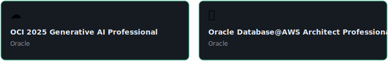

</div>

---

```json
{
  "name"     : "Prashant Raj",
  "role"     : "Backend & AI Engineer @ Visteon India",
  "location" : "Pune, India 📍",
  "education": "B.E. E&TC — Vishwakarma Institute of Technology",
  "certs"    : [
                 "OCI 2025 Generative AI Professional ☁️",
                 "Oracle Database@AWS Architect Professional 🏛️"
               ],
  "building" : "OrderMind — Spring Boot + RAG Intelligence Platform 🧠",
  "interests": ["Distributed Systems", "LLM Integration", "REST APIs", "Cloud"],
  "status"   : "🟢 Open to work — Immediate joiner"
}
```
---

## 📊 GitHub Stats

<div align="center">


<br/>


</div>

---

## 🚀 Featured Project


### Backend Order Service

Spring Boot microservice for order management.

**Tech Stack**

Java • Spring Boot • REST APIs  

🔗 https://github.com/PrashantVIT1/backend-order-service

---

### Resilient Backup Engine

High performance backup and restore system implemented in C++ with recursive file handling.

**Tech Stack**

C++ • File Systems • Linux / Windows  

🔗 https://github.com/PrashantVIT1/resilient-backup-engine

---

### Journal App

RESTful backend application for managing journal entries with MongoDB.

**Tech Stack**

Java • Spring Boot • MongoDB  

🔗 https://github.com/PrashantVIT1/journal-app

---
## 🎖️ Certifications

---

## 📈 Contribution Activity

<div align="center">

[](https://github.com/ashutosh00710/github-readme-activity-graph)

</div>

---

## 🤝 Connect with me

<div align="center">

[](https://github.com/PrashantVIT1)
[](https://linkedin.com/in/YOURPROFILE)
[](https://leetcode.com/YOURPROFILE)
[](mailto:praaj99341@gmail.com)

</div>

---

<div align="center">

*⚡ "Build systems that scale, write code that speaks."*

</div>
